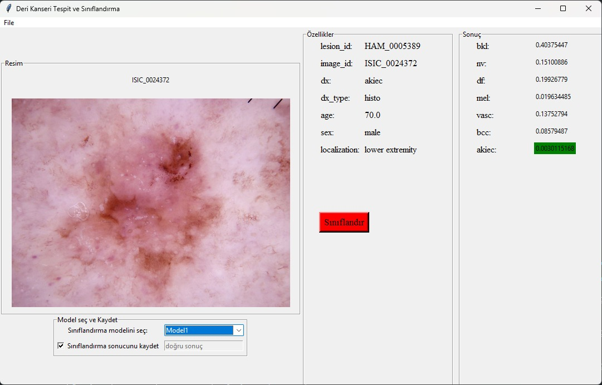

# Deri Kanseri Tespit ve Sınıflandırma Uygulaması

Bu uygulama, deri kanseri tespiti ve sınıflandırması yapmak için geliştirilmiş bir araçtır. Kullanıcılar, deri lezyonlarının görüntülerini yükleyebilir ve bu görüntülerin kanserli olup olmadığını ve hangi tür kanser olduğunu sınıflandırabilir.



## Özellikler

- Görüntü yükleme ve işleme
- İki farklı sınıflandırma modeli seçme
- Sonucu metin dosyasına kaydetme seçeneği
- Kullanıcıya görüntü üzerinde kanser türü hakkında bilgi verme

## Nasıl Kullanılır

1. "File" menüsünden "Open" seçeneği ile bir görüntü dosyası seçin.
2. Sınıflandırma modelini "Model1" veya "Model2" seçeneklerinden birini seçerek belirleyin.
3. Sonucu kaydetmek isterseniz "Sınıflandırma sonucunu kaydet" onay kutusunu işaretleyin ve bir dosya adı girin.
4. "Sınıflandır" düğmesine tıklayarak görüntüyü sınıflandırın.
5. Sonuçları sağ üst köşede görün.

## Detaylı bilgi için web sitemi ziyaret edin.(https://ayazaktas.netlify.app)

## Bağımlılıklar

Bu uygulama aşağıdaki Python kütüphanelerine ihtiyaç duyar:

- `tkinter` (Grafik arayüz oluşturmak için)
- `PIL` (Python Imaging Library - Görüntü işleme için)
- `matplotlib` (Veri görselleştirmek için)
- `pandas` (Veri çerçevesi işleme için)
- `numpy` (Sayısal hesaplamalar için)
- `seaborn` (Veri görselleştirmek için)
- `tensorflow` (Derin öğrenme için)
- `keras` (Derin öğrenme için)

-Sınıflandırma Modelleri
Bu uygulama iki farklı sınıflandırma modeli sunar: "Model1" ve "Model2". Her biri farklı özelliklere ve başarı oranlarına sahip olabilir. Hangi modelin kullanılacağını seçebilirsiniz.

-Sonuçları Kaydetme
Sonuçları kaydetmek isterseniz "Sınıflandırma sonucunu kaydet" onay kutusunu işaretleyin ve bir dosya adı girin. Sonuçlar, seçtiğiniz dosya adıyla metin dosyasına kaydedilir.

## Katkıda Bulunma
Bu projeye katkıda bulunmak isterseniz, lütfen forklayın ve pull request gönderin. Katkılarınızı memnuniyetle karşılarız!

```bash
pip install tk PILLOW matplotlib pandas numpy seaborn tensorflow keras


